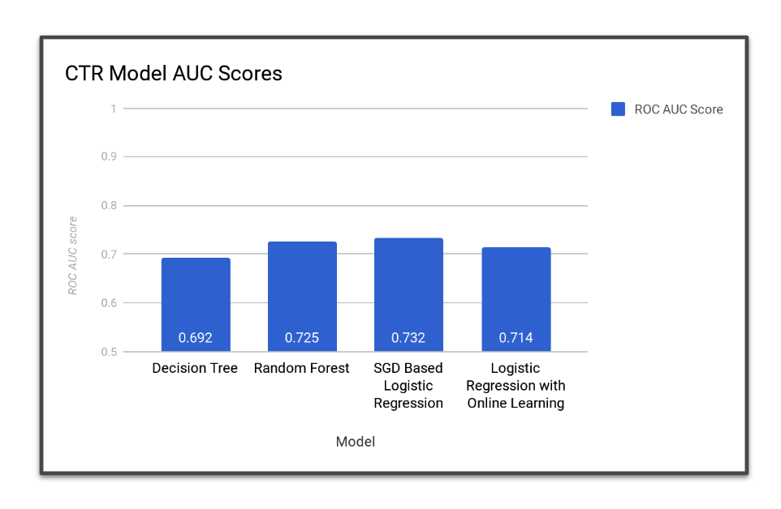

# 📈 Click-Through Rate Prediction 

In online advertising, CTR is an important metric to measure an ad's performance. In this project we use a dataset from the [Click-Through Rate Prediction](https://www.kaggle.com/c/avazu-ctr-prediction) competiton on Kaggle and evaluate methods for CTR prediction.

*In the demo below, I've trained the models already and have them stored in the 'models' directory in the repo. In order to retrain the models, go into ctr_prediction.py and set the load_model parameter to False in order to retrain on your machine.*

    

## Contents

* [Overview](#overview)
* [Dataset](#dataset)
* [Learning Algorithms Used](#learning-algorithms-used)
* [Evaluation Methods](#evaluation-methods)
* [Results](#results)
* [Usage](#usage)
* [Dependencies](#dependencies)
* [Motivation](#motivation)
* [References](#references)
* [Attribution](#attribution)
* [Contributing](#contributing)
* [License](#license)

## Overview

Digital marketers use online advertising (such as Adwords, Facebook ads, etc.) to display ads to users while they are browsing online. In order to deliver and see how well their ad performs, advertisers use click-through rate (CTR) to measure how well their ad is doing. CTR is the ratio of clicks on a specific ad to the total number of views. The higher the CTR, the better.

**Problem**: Given a user U and a page P the user is visiting, what is the probability of the user U to click the displayed ad.

For the above problem, machine learning is heavily used to in order to improve the quality of ads that are delivered to users. Here are some of the features we take into consideration when trying to predict the probability a user will click on an ad:

* Ad information and content (format, text information, position, topic/content)
* Publisher information and content of page (website type, topic, context, etc.)
* User information (age, income, search history, gender, location, interests, etc.)

## Dataset

The dataset used for this project is the [Avazu CTR Dataset](https://www.kaggle.com/c/avazu-ctr-prediction/data) which contains 11 days of click-through data. 10 days of click-through data is used for training, and 1 day of ads to test the model. The dataset contains many features including site domains, categories, user device/ip/location, banner positon, and label of whether the ad was clicked or not.

## Learning Algorithms Used

* Decision Trees
* Random Forest
* SGD-Based Logistic Regression
* Logistic Regression with Online Learning

## Evaluation Methods

To evaluate the performance of each model, we used the ROC AUC Score. Learn more about ROC curves and AUC [here](https://www.dataschool.io/roc-curves-and-auc-explained/).

## Results

    

## Usage

1. Clone repo to local directory (make sure to have Python 3.4+ installed)
2. `cd src`
3. `python ctr_prediction.py`

## Dependencies

* Scikit-Learn
* Numpy

## Motivation

As someone who has worked in digital marketing in the past and have used products such as Google Adwords and Facebook Ads, I found this project to be an exploration of learning about some of the components that go into building ad products.

## References

* [Click Through Rate Prediction for Contextual Advertisment Using Linear Regression](https://arxiv.org/pdf/1701.08744.pdf)
* [Display Advertising with Real-Time Bidding (RTB) and Behavioural Targeting](https://arxiv.org/pdf/1610.03013.pdf)
* [Simple and scalable response prediction for display advertising](http://people.csail.mit.edu/romer/papers/TISTRespPredAds.pdf)
* [Kaggle Click-Through Rate Prediction Contest](https://www.kaggle.com/c/avazu-ctr-prediction)
* [Python Machine Learning by Example](https://www.amazon.com/Python-Machine-Learning-Example-learning/dp/1783553111)
* [Ad Click Prediction: a View from the Trenches](https://static.googleusercontent.com/media/research.google.com/en//pubs/archive/41159.pdf)
* [Predict the Click-Through Rate and Average Cost Per Click for Keywords Using Machine Learning Methodologies](http://ieomsociety.org/ieomdetroit/pdfs/246.pdf)

## Attribution

* Icon by [Gilbert Bages](https://thenounproject.com/gilbertbages/) from [thenounproject](https://thenounproject.com/).

## Contributing

Contributions are always welcome! For bug reports or requests please submit an issue.

## License

[MIT](https://github.com/moebg/click-through-rate-prediction/blog/master/LICENSE)
